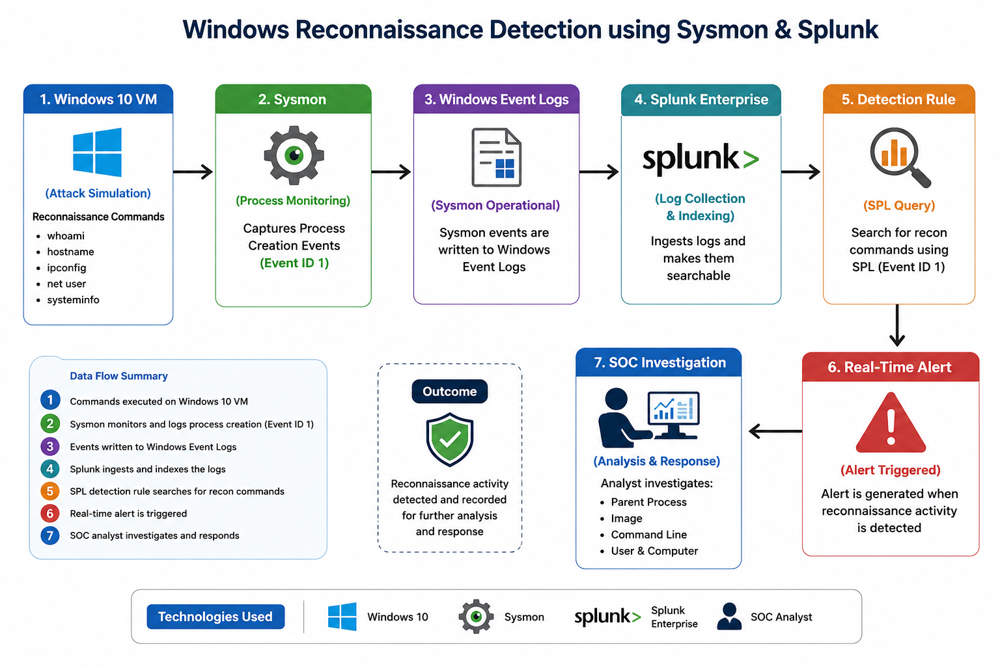

# Windows Reconnaissance Detection using Sysmon & Splunk

## Project Overview

This project demonstrates how to detect Windows reconnaissance activity using Sysmon and Splunk Enterprise in a SOC lab environment.

The objective is to simulate attacker discovery commands, collect telemetry from Sysmon, create real-time detection rules in Splunk, generate alerts, and investigate the resulting events.

This project follows the workflow used by Security Operations Centers (SOCs) for endpoint monitoring and threat detection.

---

## Objectives

- Build a Windows endpoint monitoring lab
- Collect process creation events using Sysmon
- Ingest Sysmon logs into Splunk Enterprise
- Detect reconnaissance commands using SPL
- Configure real-time alerts
- Investigate the generated events
- Map detections to the MITRE ATT&CK framework

---

## Technologies Used

- Windows 10
- VMware Workstation
- Sysmon
- SwiftOnSecurity Sysmon Configuration
- Splunk Enterprise
- SPL (Search Processing Language)

---

## 🛠 Lab Environment

| Component | Details |
|-----------|---------|
| Host Platform | VMware Workstation |
| Guest OS | Windows 10 |
| Monitoring Tool | Sysmon |
| Sysmon Configuration | SwiftOnSecurity Sysmon Config |
| SIEM | Splunk Enterprise |
| Detection Method | SPL (Search Processing Language) |
| Monitored Event | Sysmon Event ID 1 – Process Creation |

---

## 🏗 Lab Architecture

The following diagram illustrates the end-to-end detection workflow implemented in this project.



---

## Detection Workflow

1. Simulate reconnaissance commands
2. Sysmon records process creation events
3. Windows Event Logs store telemetry
4. Splunk ingests Sysmon logs
5. SPL detection identifies reconnaissance activity
6. Splunk generates an alert
7. SOC analyst investigates the event

---

## 🔍 Detection Logic

The detection focuses on identifying common Windows reconnaissance commands executed on the endpoint.

Commands monitored:

- whoami
- hostname
- ipconfig /all
- net user
- net localgroup administrators
- systeminfo

Sysmon records these process creation events (Event ID 1), and Splunk Enterprise identifies them using a custom SPL query to generate real-time alerts.

---

## 💻 SPL Detection Query

```spl
source="WinEventLog:Microsoft-Windows-Sysmon/Operational"
EventCode=1
(
Image="*\\whoami.exe" OR
Image="*\\hostname.exe" OR
Image="*\\ipconfig.exe" OR
Image="*\\net.exe" OR
Image="*\\systeminfo.exe"
)
| table _time Computer User ParentImage Image CommandLine
```
---


## MITRE ATT&CK Mapping

| Technique | ID |
|----------|----|
| System Owner/User Discovery | T1033 |
| System Information Discovery | T1082 |
| Account Discovery | T1087 |
| Network Configuration Discovery | T1016 |

---

## 📷 Screenshots

### Detection Query


---

### Alert Configuration


---

### Triggered Alert


---

### Investigation Results


---

## Repository Structure

```
windows-reconnaissance-detection-sysmon-splunk/
├── README.md
├── detections/
├── reports/
├── screenshots/
├── architecture/
├── LICENSE
└── .gitignore
```

---
## 📚 Lessons Learned

- Built a complete Windows monitoring lab using Sysmon and Splunk.
- Learned how Sysmon Event ID 1 captures process creation events.
- Developed custom SPL queries for detecting reconnaissance activity.
- Configured real-time alerting in Splunk.
- Practiced investigating alerts using process metadata such as ParentImage, Image, and CommandLine.
- Documented the complete detection workflow following SOC practices.

---

## ✅ Project Status

**Status:** Completed

This project successfully demonstrates the complete SOC detection lifecycle:

- Attack Simulation
- Telemetry Collection (Sysmon)
- Log Ingestion (Splunk)
- Detection Engineering
- Alert Generation
- Investigation
- Documentation

Future enhancements will include additional detections for PowerShell abuse, persistence mechanisms, and credential access techniques.

---

